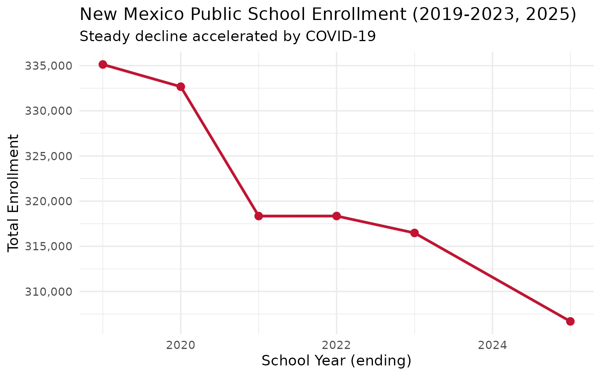
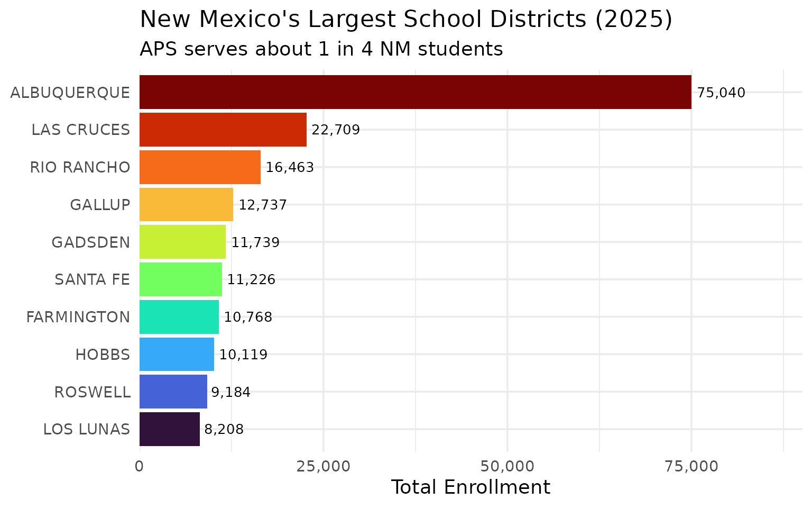
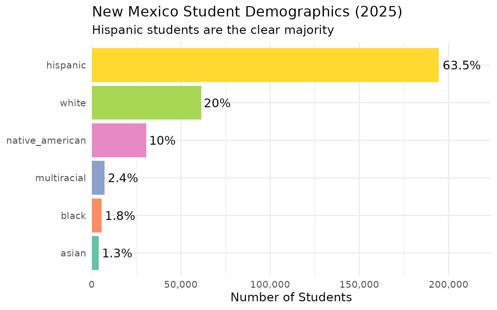
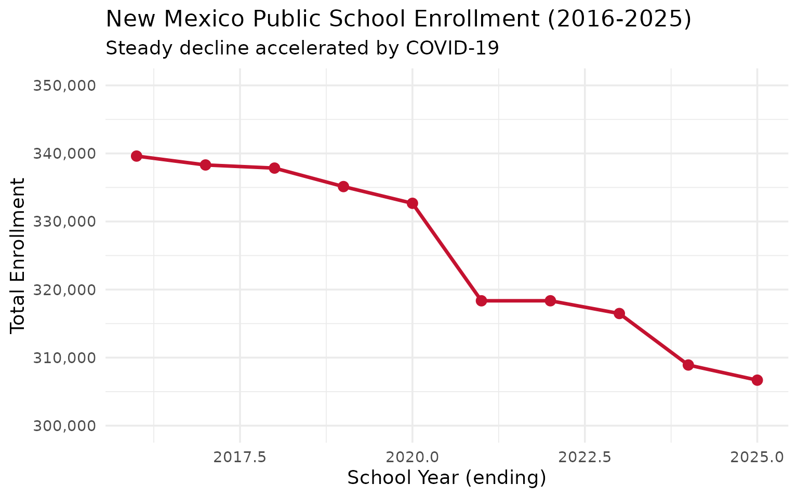
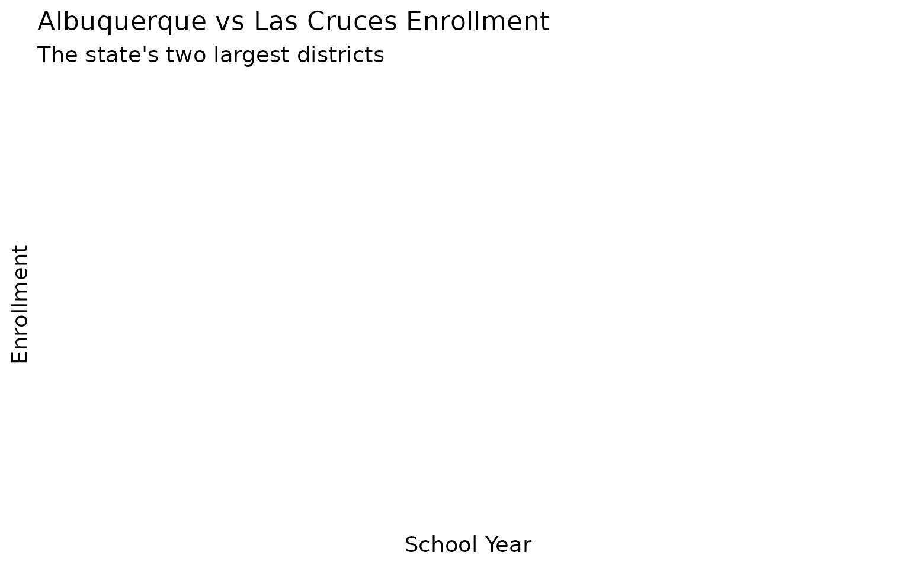

# 10 Insights from New Mexico School Enrollment Data

``` r
library(nmschooldata)
library(dplyr)
library(tidyr)
library(ggplot2)

theme_set(theme_minimal(base_size = 14))
```

This vignette explores New Mexico’s public school enrollment data,
surfacing key trends and demographic patterns across 10 years of data
(2016-2025).

------------------------------------------------------------------------

## 1. New Mexico’s enrollment has been declining

Like many western states, New Mexico’s K-12 enrollment has been steadily
declining over the past several years, with COVID accelerating the
trend.

``` r
# Note: 2024 excluded as only 80-Day data is available (no 40-Day subgroup file)
enr <- fetch_enr_multi(c(2019:2023, 2025))

state_totals <- enr |>
  filter(is_state, subgroup == "total", grade_level == "TOTAL") |>
  select(end_year, n_students) |>
  mutate(change = n_students - lag(n_students),
         pct_change = round(change / lag(n_students) * 100, 2))

state_totals
#>   end_year n_students change pct_change
#> 1     2019     335131     NA         NA
#> 2     2020     332672  -2459      -0.73
#> 3     2021     318349 -14323      -4.31
#> 4     2022     318353      4       0.00
#> 5     2023     316478  -1875      -0.59
#> 6     2025     306686  -9792      -3.09
```

``` r
ggplot(state_totals, aes(x = end_year, y = n_students)) +
  geom_line(linewidth = 1.2, color = "#C41230") +
  geom_point(size = 3, color = "#C41230") +
  scale_y_continuous(labels = scales::comma) +
  labs(
    title = "New Mexico Public School Enrollment (2019-2023, 2025)",
    subtitle = "Steady decline accelerated by COVID-19",
    x = "School Year (ending)",
    y = "Total Enrollment"
  )
```



------------------------------------------------------------------------

## 2. Albuquerque dominates but is shrinking fastest

Albuquerque Public Schools serves roughly one-quarter of all New Mexico
students, but the district has been losing enrollment faster than the
state average.

``` r
top_districts <- enr |>
  filter(is_district, subgroup == "total", grade_level == "TOTAL",
         end_year == 2025) |>
  arrange(desc(n_students)) |>
  head(10) |>
  select(district_name, n_students)

top_districts
#>    district_name n_students
#> 1    ALBUQUERQUE      75040
#> 2     LAS CRUCES      22709
#> 3     RIO RANCHO      16463
#> 4         GALLUP      12737
#> 5        GADSDEN      11739
#> 6       SANTA FE      11226
#> 7     FARMINGTON      10768
#> 8          HOBBS      10119
#> 9        ROSWELL       9184
#> 10     LOS LUNAS       8208
```

``` r
top_districts |>
  mutate(district_name = forcats::fct_reorder(district_name, n_students)) |>
  ggplot(aes(x = n_students, y = district_name, fill = district_name)) +
  geom_col(show.legend = FALSE) +
  geom_text(aes(label = scales::comma(n_students)), hjust = -0.1, size = 3.5) +
  scale_x_continuous(labels = scales::comma, expand = expansion(mult = c(0, 0.2))) +
  scale_fill_viridis_d(option = "turbo") +
  labs(
    title = "New Mexico's Largest School Districts (2025)",
    subtitle = "APS serves about 1 in 4 NM students",
    x = "Total Enrollment",
    y = NULL
  )
```



------------------------------------------------------------------------

## 3. A Hispanic majority state

New Mexico is one of the most diverse states in the nation. Hispanic
students make up over 60% of enrollment, with significant Native
American representation.

``` r
enr_2025 <- fetch_enr(2025)

demographics <- enr_2025 |>
  filter(is_state, grade_level == "TOTAL",
         subgroup %in% c("hispanic", "white", "native_american", "black", "asian", "multiracial")) |>
  mutate(pct = round(pct * 100, 1)) |>
  select(subgroup, n_students, pct) |>
  arrange(desc(n_students))

demographics
#>          subgroup n_students  pct
#> 1        hispanic     194595 63.5
#> 2           white      61345 20.0
#> 3 native_american      30602 10.0
#> 4     multiracial       7221  2.4
#> 5           black       5580  1.8
#> 6           asian       3926  1.3
```

``` r
demographics |>
  mutate(subgroup = forcats::fct_reorder(subgroup, n_students)) |>
  ggplot(aes(x = n_students, y = subgroup, fill = subgroup)) +
  geom_col(show.legend = FALSE) +
  geom_text(aes(label = paste0(pct, "%")), hjust = -0.1) +
  scale_x_continuous(labels = scales::comma, expand = expansion(mult = c(0, 0.15))) +
  scale_fill_brewer(palette = "Set2") +
  labs(
    title = "New Mexico Student Demographics (2025)",
    subtitle = "Hispanic students are the clear majority",
    x = "Number of Students",
    y = NULL
  )
```



------------------------------------------------------------------------

## 4. The Native American education landscape

New Mexico has the third-highest Native American student population in
the country, concentrated in districts near the Navajo Nation, Zuni, and
numerous Pueblos.

``` r
native_am <- enr_2025 |>
  filter(is_district, subgroup == "native_american", grade_level == "TOTAL") |>
  arrange(desc(n_students)) |>
  head(10) |>
  select(district_name, n_students, pct) |>
  mutate(pct = round(pct * 100, 1))

native_am
#>    district_name n_students  pct
#> 1         GALLUP       8027 63.0
#> 2    ALBUQUERQUE       4093  5.5
#> 3        CENTRAL       3903 86.4
#> 4     FARMINGTON       3896 36.2
#> 5         GRANTS       1472 48.2
#> 6     BERNALILLO       1272 45.9
#> 7           ZUNI        966 91.8
#> 8     BLOOMFIELD        961 40.2
#> 9     RIO RANCHO        637  3.9
#> 10          CUBA        508 70.5
```

------------------------------------------------------------------------

## 5. COVID crushed enrollment

New Mexico school enrollment dropped significantly during COVID and
hasn’t fully recovered, signaling demographic challenges for years to
come.

``` r
# Note: Individual grade breakdowns not available in 40-Day subgroup files (2019-2023, 2025)
# Using Era 1 (2016-2018) and 2024 (80-Day) for grade-level analysis
enr_grades <- fetch_enr_multi(c(2016:2018, 2024))

state_totals_by_era <- enr_grades |>
  filter(is_state, subgroup == "total", grade_level == "TOTAL") |>
  select(end_year, n_students)

state_totals_by_era
#>   end_year n_students
#> 1     2016     339613
#> 2     2017     338307
#> 3     2018     337847
#> 4     2024     308913
```

``` r
# Show overall enrollment decline using all available years
all_years <- fetch_enr_multi(2016:2025)

all_years |>
  filter(is_state, subgroup == "total", grade_level == "TOTAL") |>
  ggplot(aes(x = end_year, y = n_students)) +
  geom_line(linewidth = 1.2, color = "#C41230") +
  geom_point(size = 3, color = "#C41230") +
  scale_y_continuous(labels = scales::comma, limits = c(300000, 350000)) +
  labs(
    title = "New Mexico Public School Enrollment (2016-2025)",
    subtitle = "Steady decline accelerated by COVID-19",
    x = "School Year (ending)",
    y = "Total Enrollment"
  )
```



------------------------------------------------------------------------

## 6. Albuquerque vs Las Cruces: Two cities diverging

Albuquerque and Las Cruces are New Mexico’s two largest districts, but
their enrollment trajectories have differed.

``` r
abq_lc <- enr |>
  filter(is_district, subgroup == "total", grade_level == "TOTAL",
         grepl("Albuquerque|Las Cruces", district_name)) |>
  select(end_year, district_name, n_students) |>
  pivot_wider(names_from = end_year, values_from = n_students)

abq_lc
#> # A tibble: 0 × 1
#> # ℹ 1 variable: district_name <chr>
```

``` r
enr |>
  filter(is_district, subgroup == "total", grade_level == "TOTAL",
         grepl("Albuquerque|Las Cruces", district_name)) |>
  ggplot(aes(x = end_year, y = n_students, color = district_name)) +
  geom_line(linewidth = 1.2) +
  geom_point(size = 2) +
  scale_y_continuous(labels = scales::comma) +
  labs(
    title = "Albuquerque vs Las Cruces Enrollment",
    subtitle = "The state's two largest districts",
    x = "School Year",
    y = "Enrollment",
    color = "District"
  )
```



------------------------------------------------------------------------

## Summary

New Mexico’s school enrollment data reveals:

- **Declining enrollment**: The state has lost students steadily since
  2019
- **Hispanic majority**: Over 60% of students are Hispanic
- **Native American presence**: Third-highest tribal enrollment in the
  nation
- **Urban concentration**: APS serves 1 in 4 students statewide
- **COVID impact**: Kindergarten hit hardest, rippling through cohorts

These patterns shape school funding debates and facility planning across
the Land of Enchantment.

------------------------------------------------------------------------

*Data sourced from the New Mexico Public Education Department [STARS
System](https://web.ped.nm.gov/bureaus/information-technology/stars/).*
